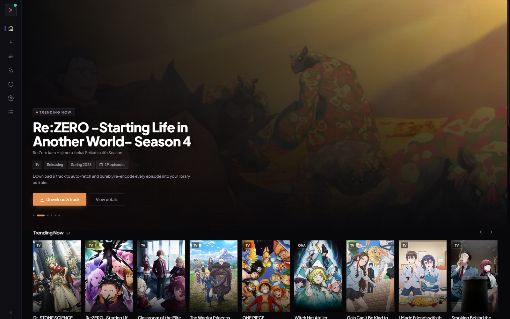
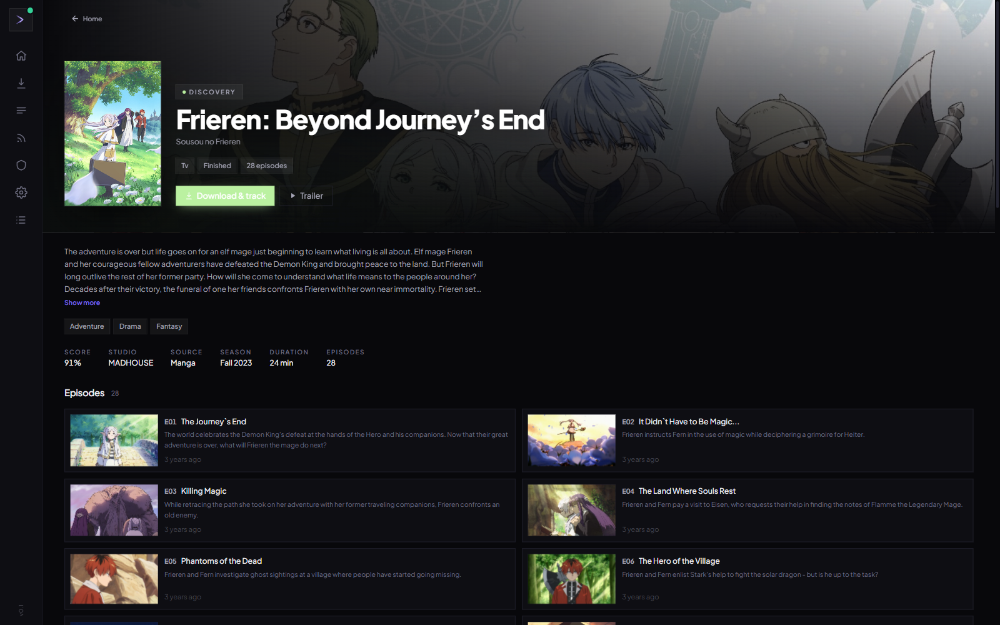

# ssanime-gui

**Discover, download, encode, and archive anime — automatically.**

A local, UI-first manager that watches for new episodes, pulls them via torrent, re-encodes them to
compact x265 files, and organises the result into a Jellyfin-compatible library. One small binary.
No cloud, no subscription, no external services required.

[](LICENSE)
[](https://github.com/modbender/ssanime-gui/actions/workflows/ci.yml)

---





---

## What it does

**discover → track → download → encode → archive**

Pick a series from the discovery home (trending, seasonal, and popular rows pulled from AniList).
One click — **Download & track** — subscribes it. From that point everything is automatic: new
episodes are detected as they air, downloaded via torrent, re-encoded with ffmpeg x265, and moved
into your archive. You close the browser. It keeps going.

**Features**

- **Discovery-first home.** Hayase-inspired hero + horizontal carousels — Trending, Popular This
  Season, All-Time Popular, genre rows — all from AniList. Never an empty library screen.
- **One-click subscribe.** "Download & track" creates the series and its feed in one action.
  Active → Completed status transitions happen automatically as a series finishes airing. Pause,
  Drop, or Resume whenever you want manual control.
- **Full series pages.** Synopsis, genres, score, studio, trailer link, per-episode thumbnails,
  titles, air dates, and overviews (AniList + ani.zip metadata). Works for both tracked series
  and untracked discovery previews.
- **Torrent-native, no external client.** An embedded `anacrolix/torrent` client handles
  everything; qBittorrent/Transmission backends are also supported if you prefer.
- **x265 re-encode with sane profiles.** Three built-in encode profiles — High Quality (CRF 18),
  Balanced (CRF 23), Fast (CRF 28) — with multi-resolution output (1080p / 720p / 480p). x265
  files are typically half the size of the source at equivalent quality.
- **RSS and scrape feed auto-downloader.** Quality and regex filter rules per feed. Interval-based
  polling runs in the background without any interaction.
- **Real-time progress.** Download %, encode %, queue view, and logs stream live in the UI over
  SSE.
- **Zero setup for ffmpeg.** ffmpeg is downloaded and checksum-verified on first run into the
  app-data folder. No PATH changes, no manual installs.
- **Built-in DNS-over-HTTPS.** Bypasses ISP-level DNS blocks of nyaa.si transparently — no VPN
  needed.
- **Background by design.** Closing the browser tab or window does not stop anything. The system
  tray keeps the daemon alive. Reopen via **Open UI** from the tray.

**What it does not do:** upload or distribute files, play or stream media, create torrents. It is
a personal archival pipeline.

---

## Install

Download the latest installer from the [Releases page](https://github.com/modbender/ssanime-gui/releases).

| Platform | File |
|---|---|
| Windows (installer) | `ssanime-gui_<version>_x64-setup.exe` |
| Windows (MSI) | `ssanime-gui_<version>_x64_en-US.msi` |
| Linux | `.deb`, `.rpm`, or `.AppImage` |

**Windows:** installers are currently unsigned. Windows SmartScreen will show an "unknown
publisher" dialog — click **More info → Run anyway** to proceed. WebView2 is pre-installed on
Windows 11; the installer handles it automatically on older systems.

**Linux:** no signing prompt — `.deb`/`.rpm`/`.AppImage` install and run directly.

**macOS:** no prebuilt app yet (an unsigned build would be blocked by Gatekeeper). Until signed
builds exist, build from source on a Mac with `mage server`.

---

## Quick start

1. Install and launch ssanime-gui. The UI opens at `http://127.0.0.1:4773/` in your browser.
   (Or use the optional Tauri desktop app, which wraps the same UI in a native window.)
2. Browse the discovery home — trending and seasonal rows load automatically from AniList.
3. Click a series you want, then **Download & track**. That's it.
4. The daemon finds the torrent, downloads, encodes, and archives each episode as it airs.

**Where files land:** configurable in **Settings** — separate paths for the working download
directory and the final archive. The archive is laid out in Jellyfin-compatible folder structure.

**System tray** (bottom-right on Windows): **Open UI** · **Pause all** · **Quit**. Graceful
shutdown waits for in-flight jobs to reach a checkpoint.

**Logs:** `{DataDir}/ssanime.log`
- Windows: `%APPDATA%\ssanime-gui\`
- Linux/macOS: `~/.config/ssanime-gui/`

---

## Build from source

**Requirements:** Go 1.25+, [Bun](https://bun.sh), [Mage](https://magefile.org)
(`go install github.com/magefile/mage@latest`).

```sh
mage -l          # list all targets
mage server      # build the headless daemon for the current OS
mage tauri       # build the Tauri desktop app (requires Rust 1.75+)
```

`mage server` produces a single binary (`ssanime.exe` on Windows) with the Svelte SPA embedded.
`mage tauri` runs frontend → sidecar → Tauri build in order and emits installers to
`desktop/target/release/bundle/`.

For release packaging, CI configuration, and Windows/macOS code-signing options, see
[docs/distribution.md](docs/distribution.md).

---

## License

GPL-3.0. See [LICENSE](LICENSE).

This tool is for managing your own personal media library. You are responsible for ensuring that
what you download complies with the laws of your jurisdiction.
